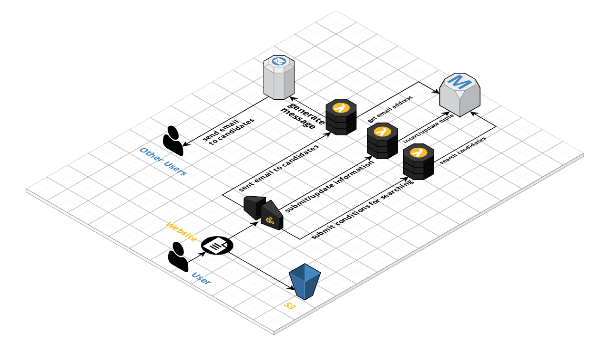

# CMSC389L-Final-Project CheckPoint 2

## Relational DataBase

create.sql contains the commands to build the relations tables for this project.

## PHP

- All codes for the website are stored in /src.
- MainPage.html completed.
- updateInfo.php for updating personal info completed.
- signup.php completed.
