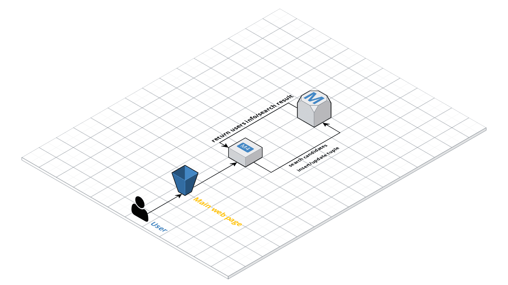

# CMSC389L-Final-Project CheckPoint 2

## Relational DataBase

create.sql contains the commands to build the relations tables for this project.

## S3

The files under this directory are stored in AWS S3 as static Web Hosting.

## EC2

The files under this directory are placed in AWS EC2 as dinamic Web Hosting.
